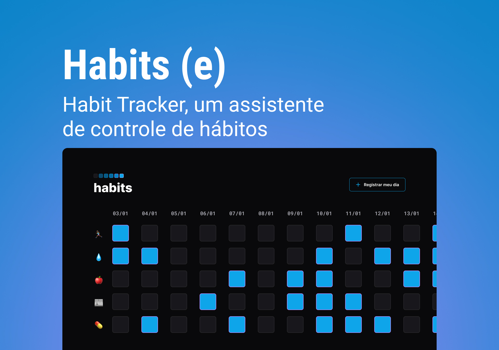

<h1 align="center"> Projeto Habits (e) </h1>

Projeto desenvolvido no NLW Setup, promovido pela Rocketseat, com o professor Myk Brito.

  <a href="#-tecnologias">Tecnologias</a>&nbsp;&nbsp;&nbsp;|&nbsp;&nbsp;&nbsp;
  <a href="#-projeto">Projeto</a>&nbsp;&nbsp;&nbsp;|&nbsp;&nbsp;&nbsp;
  <a href="#-aprendizado">Aprendizado</a>&nbsp;&nbsp;&nbsp;|&nbsp;&nbsp;&nbsp;
  <a href="#memo-licença">Licença</a>

  

 

  

## 🚀 Tecnologias

Esse projeto foi desenvolvido com as seguintes tecnologias:

- HTML e CSS
- JavaScript
- Git e Github
- Figma

## 💻 Projeto

O Projeto Habits (e) é um app desenvolvido para rastrear os hábitos diários.

- [Acesse o projeto finalizado, online](https://camillamorais.github.io/projeto-habits/)

## 📖 Aprendizado

- Fundamentos do HTML5 e CSS3.
- Criação de componentes do site, como buttons e inputs.
- Fundamentos do JavaScript, como registrar e armazenar dados do usuário. 

## :memo: Licença

Esse projeto está sob a licença MIT.

---